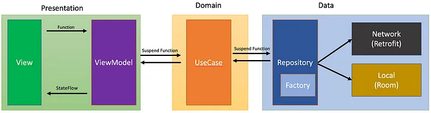

# Casey - Cooking and shopping assistant

## Description

Casey is a cooking and shopping assistant that helps you plan your meals, create shopping lists, 
and find recipes. It uses the [Spoonacular API](https://spoonacular.com/food-api) to provide 
recipes and nutritional information.

## Features

- Search for recipes by name, ingredients, or dietary restrictions
- Bookmark recipes
- Add ingredients to your shopping list
- View nutritional information for recipes

## Technologies

- [Jetpack Compose](https://developer.android.com/jetpack/compose)
- [KSP](https://developer.android.com/kotlin/ksp)
- [Dagger Hilt](https://developer.android.com/training/dependency-injection/hilt-android)
- [Retrofit](https://square.github.io/retrofit/)
- [Room](https://developer.android.com/jetpack/androidx/releases/room)
- [Coil](https://coil-kt.github.io/coil/compose/)
- [Firebase](https://firebase.google.com/)
- [Spoonacular API](https://spoonacular.com/food-api)
- [Material Design Components](https://material.io/develop/android/docs/getting-started/)

## Architecture

Casey uses the MVVM clean architecture pattern. The app is divided into three layers:

- **Presentation**: Contains the UI components and view models.
- **Domain**: Contains the business logic and use cases.
- **Data**: Contains the data sources and repositories.
  - **Local**: Contains the Room database and DAOs.
  - **Remote**: Contains the Retrofit API service.

